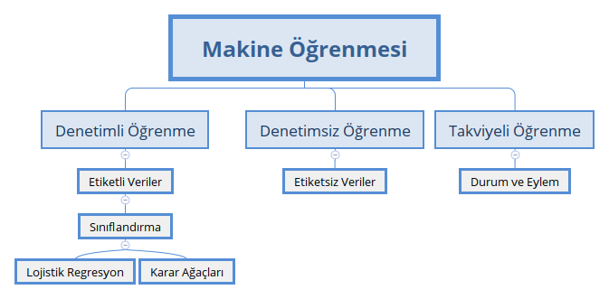

# Sınıflandırma için Makine Ögrenmesi BP Projesi
"Sınıflandırma için Makine Öğrenmesi Projesi" DEÜ Fen Fakültesi İstatistik Bölümü 2019-2019 Bitirme Projesi kapsamında RStudio programında rmarkdown paketi ile yapılmıştır.

Yazarlar: Hüseyin Cem ARAS, İbrahim Berkay ÖZ

Danışman: Doktor Öğretim Üyesi Özgül VUPA ÇİLENGİROĞLU

Çalışma Ortağı: SANEM Plastik Tasarım Merkezi Müdürü Alim Fatih KILINÇ

## Hakkında
İzmir ili Torbalı ilçesinde plastik masa örtüsü üretimi gerçekleştiren SANEM PLASTİK adlı fabrikadan alınan 2018-2019 yılları arasındaki veriler ile makine öğrenimi algoritmalarını kullanarak model oluşturulup, modele göre fabrikanın verimliliğini arttırmaktır. Bağımlı değişken OEE'dir.

Overall Equipment Effectiveness” kısaltmasıdır. Türkçe çevirisi Toplam Ekipman Etkinliği’dir. OEE bütün ekipmanların ne ölçüde kullanıldığına işaret eden bir TPM(total productive maintenance) hesabıdır. Arızalar, ekipman ayarları, duruşlar, çalışma hızındaki azalmalar, ıskartalar ve yeniden işlem gibi kayıplar üzerine düşer.

Bu çalışma ile üretim yapan fabrikaların verisinde makine öğrenimi kapsamında yer alan sınıflandırma modellerinden lojistik regresyon ve CART modellerinin uygulanabilirliği tespit edilmiştir. Bu tip verilerde değişik sınıflandırma algoritmaları da kullanılabilir. Ayrıca bu algoritmaların performansları da karşılaştırılabilir.

Proje hakkında detaylı bilgi edinmek için _proje dökümanlarına_ gözatabilirsiniz.

## Proje Dökümanları
- [Proje Rapor](/pdfs/Rapor.pdf)
- [Proje Sunumu](/pdfs/Sunum.pdf)
- [Proje Posteri](/pdfs/Poster.pdf)

Bu projede DEÜ Fen Fakültesi İstatistik Bölümünün [Bitirme Projeleri](http://istatistik.deu.edu.tr/index.php/tr/bitirme-projeleri/) için hazırlamış olduğu template kullanılmıştır.

[Index](/index) klasörünün içerisinde proje için gerekli olan bütün dosyalar yer almaktadır. Klasörü indirdikten sonra İşletim Sisteminize uygun olarak aşağıdaki bağlantılardan ilgili programları indirerek çalışmadaki Uygulama bölümündeki adımları tek tek uygulayabilirsiniz.

## Gerekli programlar:
- [Miktex](https://miktex.org/download)
- [R](https://cloud.r-project.org/)
- [RStdio](https://rstudio.com/products/rstudio/download/)

    
 
      

